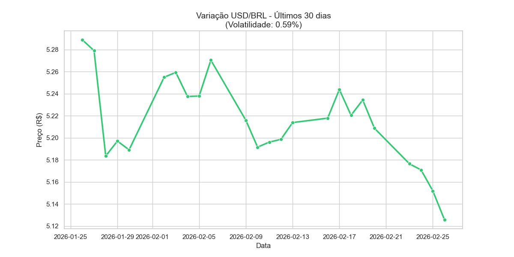

# 📊 Análise de Volatilidade de Câmbio (USD/BRL) / Exchange Volatility Analysis

Este projeto utiliza **Python**, **NumPy**, **Seaborn** e **yfinance** para realizar uma análise estatística e visual da variação do dólar frente ao Real brasileiro nos últimos 30 dias.

*This project uses **Python**, **NumPy**, **Seaborn**, and **yfinance** to perform a statistical and visual analysis of the USD/BRL exchange rate variation over the last 30 days.*

---

## 📈 Visualização de Dados / Data Visualization

---

## 🛠️ Tecnologias / Technologies
* **Python**
* **NumPy**: Processamento de arrays e estatística / *Array processing and statistics*.
* **Seaborn & Matplotlib**: Visualização de dados / *Data visualization*.
* **yfinance**: Coleta de dados financeiros em tempo real / *Real-time financial data collection*.

## 📉 Insights Gerados / Insights Generated
- [x] **Cálculo de Volatilidade**: Identificação do risco do período através do desvio padrão / *Volatility calculation via standard deviation*.
- [x] **Relatório Estatístico**: Média, máxima e mínima automatizados / *Automated Mean, Max, and Min reporting*.
- [x] **Análise Temporal**: Gráfico de linha para acompanhamento de tendência / *Line plot for trend tracking*.

## 🚀 Como executar / How to run
1. Instale as dependências / *Install dependencies*: `pip install -r requirements.txt`
2. Execute o script / *Run the script*: `python analise_cambio.py`